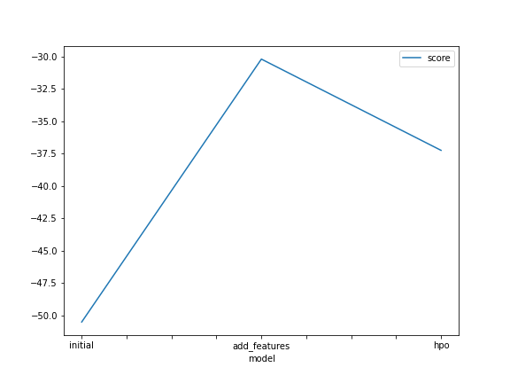
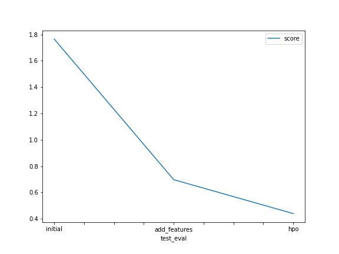

# Report: Predict Bike Sharing Demand with AutoGluon Solution
####  Sara Zaky

## Initial Training
### What did you realize when you tried to submit your predictions? What changes were needed to the output of the predictor to submit your results?
I needed to remove any negative values and set them to zero, I also needed to set the predictions to the submission dataframe

### What was the top ranked model that performed?
'WeightedEnsemble_L3' was the top ranked model

## Exploratory data analysis and feature creation
### What did the exploratory analysis find and how did you add additional features?
Exploratory data analysis found that season and weather features are categorical features, and datetime feature will be more informative if we split it to hour, day, month
hour, day, month features
I addedd additional features by splitting the datetime feature to hour, day, month features

### How much better did your model preform after adding additional features and why do you think that is?
the score significantly change from 1.76380 to 0.69744 which is way more better

that happend because we added useful features to the model, and better represented the season and weather features 

## Hyper parameter tuning
### How much better did your model preform after trying different hyper parameters?
the score became better, changed from 0.69744 to 0.44058

### If you were given more time with this dataset, where do you think you would spend more time?
in Exploratory data analysis trying to better understand the data and do more feature engineering to get better features and try more suitable models

### Create a table with the models you ran, the hyperparameters modified, and the kaggle score.
|model|objective|n_estimators|max_depth|score|
|--|--|--|--|--|
|initial|reg:squarederror'|100|6|1.76380|
|add_features|reg:squarederror'|100|6|0.69744|
|hpo|count:poisson|5|199|0.44058|

### Create a line plot showing the top model score for the three (or more) training runs during the project.

TODO: Replace the image below with your own. DONE

### Create a line plot showing the top kaggle score for the three (or more) prediction submissions during the project.

TODO: Replace the image below with your own.

 DONE

## Summary
Adding more features and changing the hyperparameters value improved the performance
